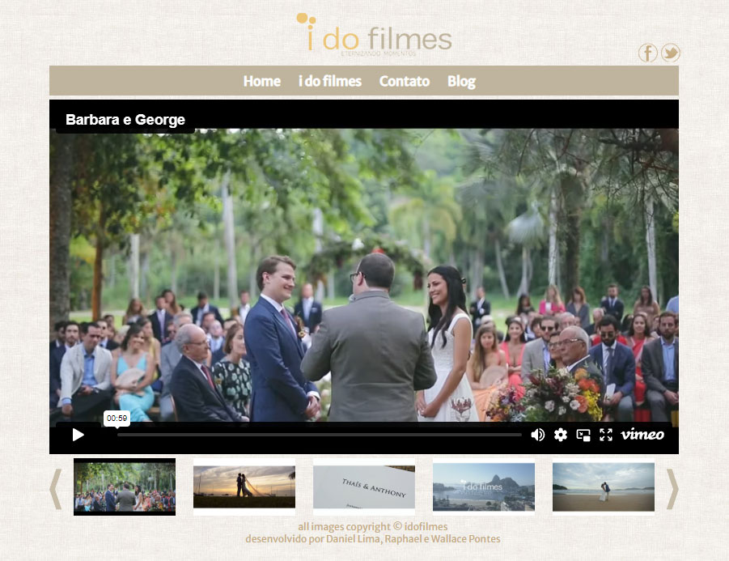

***



Site feito para a produtora de vídeo voltada para vídeos casamentos I do Filmes.

## Criação

Site criado em abril de 2013 com código feito por mim e Raphael Jangi e design feito por Daniel Lima.
O site foi criado no Dreamweaver utilizando uma imagem em PSD com camadas separadas criada pelo Daniel Lima.

Foi utilizado o Vimeowrap que é um script que usa a biblioteca jQuery onde são adicionados automaticamente os últimos vídeos de uma canal do Vimeo em formato de slider.

```html
<div id="player"></div>
<script>
    vimeowrap('player').setup({
        width: 778,
        height: 438,
        color: 'bfb49d',
        autoplay: false,
        portrait: false,
        title: true,
        byline: false,
        urls: [
            'http://vimeo.com/user9410249'
        ],
        plugins: {
            'carousel': {
                 width: 778,
                 height: 150,
                 offsetx: 30,
                 offsety: 5,
                 visible: 5,
                 autoplay: true,
                 thumb: {
                     width: 126,
                     height: 71,   
                     quality: 'large'
                 }
            }
        }
    });
</script>
```

## Contato

Foi utilizado também um formulário simples em PHP onde o cliente envia a mensagem e vai direto para o e-mail escolhido.

```php
$name = ($_GET['name']) ? $_GET['name'] : $_POST['name'];
$email = ($_GET['email']) ?$_GET['email'] : $_POST['email'];
$comment = ($_GET['comment']) ?$_GET['comment'] : $_POST['comment'];

 //recipient
 $to = 'contatoidofilmes@gmail.com'; 
 //sender
 $from = $name . ' <' . $email . '>';
 
 //subject and the html message
 $subject = 'Comentário de ' . $name; 
 $message = '
 <!DOCTYPE html PUBLIC "-//W3C//DTD XHTML 1.0 Transitional//EN" 
 "http://www.w3.org/TR/xhtml1/DTD/xhtml1-transitional.dtd">
 <html xmlns="http://www.w3.org/1999/xhtml">
 <head></head>
 <body>
 <table>
  <tr><td>Nome:</td><td>' . $name . '</td></tr>
  <tr><td>Email:</td><td>' . $email . '</td></tr>
  <tr><td>Comentário:</td><td>' . nl2br($comment) . '</td></tr>
 </table>
 </body>
 </html>';
```

Você pode conferir o site em https://www.idofilmes.com.br/
